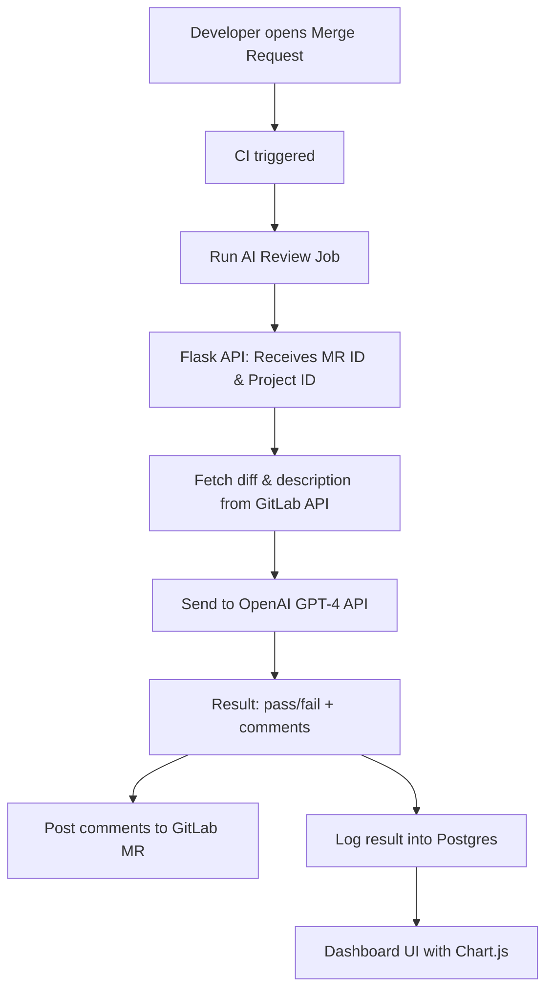

# GitLab AI Code Reviewer

[GitLab Demo](https://gitlab.com/nvlinh99/test-review-code/-/merge_requests)

## 🖼 Architecture Flow



> *CI → FastAPI → GPT → GitLab comment + DB log → Dashboard*

## ✨ Features
- ✅ Auto-fetch MR diff & description
- 🤖 GPT-4-based code review [OpenAI / Github Models]
- 💬 Inline comments to GitLab MR
- 🧩 GitLab CI/CD ready
- 🏷️ Adds badge label `ai-reviewed:pass|fail`
- 📥 Logs feedback rating (1–5) to DB
- 🛠️ Optional: Auto-fix patch block suggestion

---

## 📦 Project Structure

```
├── app/
│   ├── api.py 
│   ├── main.py                # Main script for review flow
├── config/                 # Static files and charts
├── docker/                   
│   ├── Dockerfile             # Dockerized deployment
│   └── nginx.conf             # Proxy for Flask
├── fine-tune/                
│   ├── train_code.py          # Fine-tune CodeT5/StarCoder (optional)
│   └── train.json             # Training samples
├── infra/
│   ├── .gitlab-ci.yml         # GitLab CI job integration
│   └── docker-compose.yml     # Local/dev deployment
└── README.md                  # Project overview
```

---

## ⚙️ Usage

### 1. Install dependencies
```bash
pip install -r api/requirements.txt
```

### 2. Set environment variables
```bash
export GITLAB_TOKEN=your_token
export OPENAI_API_KEY=your_openai_key
export CI_PROJECT_ID=your_project_id
export CI_MERGE_REQUEST_IID=your_mr_iid
```

### 3. Run the review script
```bash
python api/main.py
```

This will:
- Fetch diff and description
- Send to OpenAI
- Post comments to GitLab
- Log to database

---

## 🚀 GitLab CI Integration
Example `.gitlab-ci.yml` job:
```yaml
stages:
  - ai_review

auto_review:
  stage: ai_review
  image: python:3.10
  script:
    - pip install -r api/requirements.txt
    - python api/main.py
  only:
    - merge_requests
```

---

## 📊 Dashboard (Optional)
Flask + Jinja2 + Chart.js based UI

### Features:
- MR history
- PASS/FAIL filter
- Comments per MR
- Excel/PDF export
- Submit feedback rating

### Feedback Form:
```html
<form method="POST">
  <label for="rating">Was the AI suggestion helpful?</label>
  <select name="rating">
    <option value="5">Excellent</option>
    <option value="4">Good</option>
    <option value="3">Average</option>
    <option value="2">Poor</option>
    <option value="1">Wrong</option>
  </select>
  <button type="submit">Submit</button>
</form>
```

> Useful for building fine-tuning dataset

---

## 🧠 Advanced Extensions

### 🛠 Auto-fix Patch Suggestion
Append this to your prompt:
```
If fixable, include a "fix" field:
--- path/to/file.ext
+++ path/to/file.ext
@@ -42,7 +42,7 @@
- old code
+ new code
```

Use GitLab markdown to render in MR comment.

### ⭐ Feedback Rating API
```python
@app.route("/feedback", methods=["GET", "POST"])
def feedback():
    if request.method == "POST":
        rating = int(request.form["rating"])
        mr_id = request.form["mr_id"])
        cur = conn.cursor()
        cur.execute("UPDATE ai_reviews SET feedback_rating = %s WHERE mr_iid = %s", (rating, mr_id))
        conn.commit()
        return "Thank you!"
    return render_template("feedback_form.html")
```

### 🏷 Add GitLab MR Label
```python
def add_label(label):
    url = f"{GITLAB_API}/projects/{PROJECT_ID}/merge_requests/{MR_IID}/labels"
    headers = {"PRIVATE-TOKEN": GITLAB_TOKEN}
    payload = {"labels": label}
    requests.put(url, headers=headers, json=payload)

# Usage:
add_label("ai-reviewed:pass")
```

---

## 📌 Notes
- Ensure GitLab token has `api` scope
- OpenAI usage may incur cost
- Prompt/model can be adjusted to suit context

---
Feel free to fork, contribute, or open issues!
